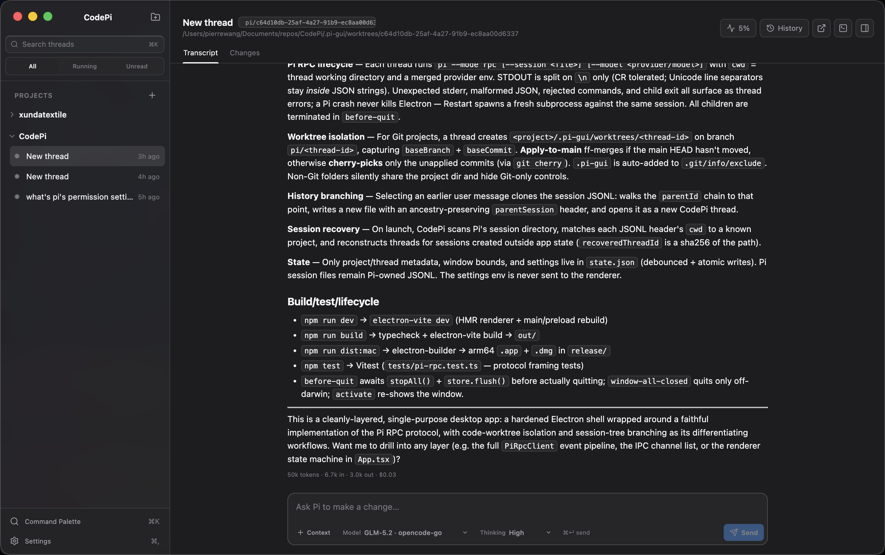

# CodePi

CodePi is a macOS-first desktop command center for the [Pi coding agent](https://github.com/earendil-works/pi). It runs one Pi RPC subprocess per open thread, keeps multiple agents active in parallel, renders their streamed work as a native-feeling conversation, and adds Git review, project context, usage visibility, and everyday thread organization.



> CodePi is currently macOS-only. Platform checks and process-launch details are isolated so Windows and Linux support can be added later without changing the renderer contract.

## What is included

- Per-thread Pi extension and skill controls, including resources discovered from user, project, package, and Pi settings locations.
- A context-rich composer with file and image attachments, drag and drop, pasted screenshots, `@file` suggestions, Pi slash-command suggestions, recent files, built-in prompts, and saved prompt templates.
- A context and cost dashboard with current-session statistics, project usage totals, a 14-day chart, manual compaction, auto-compaction, and auto-retry controls.
- A right-side workspace dock with a read-only file viewer, a real PTY terminal, and a loopback-only app preview.
- Daily thread management: rename, pin, archive, mark read or unread, tag, duplicate, search, export, move to Trash, restore, and permanently delete.
- The existing Codex-style Git changes view, isolated worktrees, session-tree history, and branch-from-history workflow.

## Prerequisites

- macOS on Apple silicon
- Node.js 22.12 or newer
- Xcode Command Line Tools, recommended and required if the native `node-pty` terminal dependency must compile locally
- Git for changes and worktree features
- Pi on `PATH`

Install Pi if needed:

```bash
npm install -g --ignore-scripts @earendil-works/pi-coding-agent
pi --version
```

CodePi validates the configured binary on launch. If it cannot run `<binary> --version`, the app opens an onboarding screen instead of failing. A custom binary path and provider environment variables can be set in Settings.

## Run locally

```bash
npm install
npm run dev
```

`npm install` also installs Electron and runs `electron-builder install-app-deps`, which rebuilds `node-pty` for Electron. If the native terminal dependency fails to install, install the Xcode Command Line Tools and run `npm install` again.

Build the production bundles and verify TypeScript:

```bash
npm run build
```

Create an Apple-silicon `.app` and `.dmg` in `release/`:

```bash
npm run dist:mac
```

The macOS target is currently `arm64` only. `electron-builder` automatically uses an available signing identity; without one it can still create an unsigned local build. Hardened runtime is enabled. Notarization credentials and release automation are not stored in this repository.

Run the tests or type-check separately:

```bash
npm test
npm run typecheck
```

The production archive keeps `node-pty` unpacked from ASAR because it contains a native binary. Re-run `npm install` after changing Electron versions or switching CPU architecture so that native dependencies are rebuilt for the target runtime.

## Getting started

1. Add a project with the folder button or **File → New Project** (`⇧⌘N`).
2. Create a thread with the plus button or **File → New Thread** (`⌘N`).
3. New threads use the project's current branch by default. For Git projects, enable **Run in isolated worktree** to work on a dedicated `pi/<thread-id>` branch under `.pi-gui/worktrees/`.
4. Choose the active model and thinking level beneath the message field.
5. Add context, send a prompt, and continue working in another thread while Pi runs.
6. Use **Changes** for Git review and the workspace button in the thread header for Files, Terminal, or Preview.

## Composer context

The **Context** menu beneath the composer brings project material and Pi capabilities into the current request:

- **Attachments:** choose files with the native picker, drag files onto the composer, or paste screenshots directly. Image data is sent through Pi's image-capable RPC prompt; small text files are inlined as context; other accepted files are copied into CodePi's per-thread attachment storage and passed to Pi by path.
- **`@file`:** type `@` at the end of the current token to search the thread workspace. An empty `@` shows recently modified files.
- **Slash commands:** type `/` at the beginning of a draft to autocomplete commands returned by Pi's `get_commands` RPC operation. The Context menu also exposes a searchable command list.
- **Prompts:** insert the built-in review, planning, test-fixing, and explanation prompts, or create, reuse, and delete saved prompt templates.
- **Extensions and skills:** search discovered Pi resources and switch them on or off for this thread.

CodePi accepts up to 12 attachments per send and applies size limits before data reaches Pi. The main process validates attachment paths and file sizes again rather than trusting renderer input.

### Per-thread extensions and skills

Capability choices are stored on the thread. Every Pi subprocess starts with automatic discovery disabled and then receives only the enabled resource paths:

```text
pi --mode rpc ... --no-extensions --no-skills \
  --extension <enabled-extension> \
  --skill <enabled-skill>
```

Changing a toggle is allowed only when the thread is not running or waiting. The change immediately restarts that thread's Pi subprocess against the same session; other threads and their processes are unaffected. Duplicated threads inherit the source thread's capability choices.

If an incompatible extension prevents Pi from starting, the thread error screen offers **Restart with extensions off**. This disables all discovered extensions and skills for that thread only, restores RPC access, and lets you re-enable compatible resources individually from the composer.

CodePi intentionally does not add a separate approval or permission-control layer around Pi tools. A thread's working directory controls its starting context, and an isolated Git worktree separates changes, but the Pi subprocess is not an operating-system sandbox.

## Context and cost dashboard

Click **Usage** in the thread header to see:

- current-thread token totals, reported cost, and context-window utilization;
- today's and this month's locally recorded usage for the current project;
- a daily token chart for the most recent 14 days;
- **Compact context now** for a manual Pi compaction;
- auto-compaction and auto-retry switches.

Usage is recorded when a turn settles. Cost appears only when Pi and the active provider report it, so a zero value can mean that pricing data was unavailable rather than that the request was free. Manual compaction is disabled while a turn is streaming.

Pi persists auto-compaction and auto-retry in its global settings. CodePi labels these controls **Pi-wide** and changes them only when you explicitly use a switch; merely opening a thread does not rewrite either setting.

## Workspace dock

Open the panel button at the right of the thread header or use the command palette:

- **Files** lists source files beneath the thread working directory and opens a read-only text preview. Generated/dependency directories are skipped, binary files are not rendered, and previews are capped at the first 2 MB.
- **Terminal** starts a native PTY in the thread working directory and renders it with xterm.js. Closing the pane terminates that terminal; archiving, trashing, or quitting also cleans up active PTYs.
- **Preview** embeds a sandboxed `WebContentsView` for `http://` or `https://` development servers on `localhost`, `127.0.0.1`, or `::1`. Remote hosts, popups, downloads, credentials in URLs, and web permission requests are blocked.

## Everyday thread management

Use the `•••` menu beside a thread to rename it, duplicate it, pin it, mark it read or unread, add comma-separated tags, archive it, export it, or move it to Trash.

- Pinned threads appear in their own sidebar section. Active threads remain grouped by project; Archived and Trash are collapsible sections.
- The sidebar can filter **All**, **Running**, or **Unread** threads and match thread titles, projects, paths, and tags.
- The command palette searches actions and thread metadata immediately, then adds matches from Pi session transcripts.
- Archiving stops that thread's Pi process, terminal, and preview. Unarchive it before sending another prompt.
- Duplicating copies the current Pi session ancestry into a new session. An isolated source thread gets a new isolated worktree and branch.
- Export writes a self-contained Markdown or HTML transcript through a native save dialog, including displayed thinking, tool calls/results, and reported usage.
- Moving to Trash is reversible and preserves the Pi session and worktree. Permanent deletion requires confirmation and removes CodePi metadata; isolated worktrees and branches are cleaned up only after safety checks.

Restoring a trashed thread requires its working directory to still exist.

## Keyboard shortcuts

| Shortcut | Action |
| --- | --- |
| `⌘N` | New thread |
| `⇧⌘N` | Add project folder |
| `⌘K` | Open or close the command palette / search threads |
| `⌘,` | Open Settings |
| `⌘W` | Close the current window |
| `⌘Enter` | Send a prompt; steer immediately while Pi is running |
| `⌥Enter` | Queue a follow-up while Pi is running; send normally while idle |
| `Esc` | Abort the active turn, or close the active popover/sheet |
| `⌘Enter` in Changes | Commit the staged changes |
| `⌘S` in Settings | Validate and save settings |

## Git and worktree behavior

For a Git project, an isolated thread creates:

```text
<project>/.pi-gui/worktrees/<thread-id>
branch: pi/<thread-id>
```

The stored base branch and commit define the Changes comparison and the commit range applied back to the main checkout. **Changes** can inspect unified diffs, stage or unstage individual files, commit, commit and push, open the directory in an editor, or apply an isolated branch back to the main checkout. Non-Git folders silently use the project directory and omit Git-only controls.

## Architecture and RPC lifecycle

CodePi keeps Electron's privilege boundary narrow:

```text
React renderer (sandboxed)
        │ typed, allowlisted invoke/event API
        ▼
contextBridge preload
        │ validated IPC
        ▼
Electron main process
  ├─ app, windows, menu, settings, and state v2
  ├─ attachments, workspace files, transcript search, and export
  ├─ Git and worktree services
  ├─ native PTY service and localhost preview service
  └─ PiProcessManager
       └─ PiRpcClient × open thread
            └─ pi --mode rpc (cwd = thread working directory)
```

### Main process

The main process owns child processes, filesystem access, native dialogs, Git, worktrees, terminal PTYs, preview views, application state, native theme control, and external-editor launches. Renderer-provided identifiers and paths are resolved against known project and thread records. Git and Pi commands use argument arrays rather than an interpolated shell.

The primary window uses `titleBarStyle: 'hiddenInset'`, macOS traffic-light positioning, and sidebar vibrancy. Settings opens in a separate compact frameless window. The native application menu supplies About, Settings, File, Edit, and Window actions.

### Preload and renderer

The preload exposes `window.codePi`, a typed, allowlisted API built with `contextBridge`. Both windows use:

- `contextIsolation: true`
- `nodeIntegration: false`
- `sandbox: true`

No Node, Electron, filesystem, process, Git, PTY, or unrestricted browser primitives are exposed to React, and the deprecated remote module is not used. IPC requests are accepted only from the expected top-level CodePi window and origin.

The renderer owns presentation and ephemeral view state. It follows `nativeTheme` unless overridden, virtualizes long transcripts, sanitizes rendered Markdown with DOMPurify, and highlights transcript code with Shiki. Privileged work always returns through the preload API.

### Pi RPC lifecycle

A Pi process is started lazily when a thread is opened. Its `cwd` is the thread's project directory or isolated worktree, and it receives the configured provider environment. Existing sessions are reopened with `--session`; a configured default model is passed only when creating a session. Multiple opened threads keep independent subprocesses and can stream in parallel.

RPC commands and responses are correlated with request IDs. Stdout is decoded incrementally as newline-delimited JSON, with partial records retained between chunks. Pi events are normalized into typed text, thinking, tool-call, tool-output, queue, abort, error, turn-end, and settled events before crossing IPC.

CodePi maps the documented RPC operations directly:

- normal prompt: `prompt`
- live steering: `steer`
- deferred follow-up: `follow_up`
- cancellation: `abort`
- model discovery and switching: `get_available_models` and `set_model`
- thinking level: `set_thinking_level`
- command discovery: `get_commands`
- compaction and retry settings: `compact`, `set_auto_compaction`, and `set_auto_retry`
- transcript and state recovery: `get_state`, `get_messages`, and `get_session_stats`

Pi crashes and malformed RPC records are surfaced as thread errors rather than terminating Electron. **Restart** creates a fresh subprocess against the same session. Archiving or trashing a thread stops its process, and all Pi and terminal child processes are terminated during `before-quit`.

## State, sessions, and credentials

CodePi writes `state.json` below Electron's `app.getPath('userData')` using atomic replacement. State schema v2 stores projects, thread metadata, window bounds, settings, prompt templates, the local usage ledger, lifecycle fields, tags, unread state, and per-thread disabled capability IDs.

When a v1 state file is opened, CodePi creates a one-time sibling backup named `state.json.v1.bak` before normalizing it to the v2 shape. Subsequent writes use v2. A state file from a future schema version is rejected rather than overwritten.

Pi remains the source of truth for conversation history. Sessions stay in Pi-owned JSONL files, and CodePi scans session headers on launch to recover threads associated with known project working directories. Branching and duplication create new Pi-compatible session files without rewriting the source JSONL file.

Environment values entered in Settings are exposed only to the Settings renderer for editing and to newly spawned Pi subprocesses. This MVP stores them in `state.json`; it does not claim Keychain-grade secret storage. Prefer provider login handled by Pi or environment injection outside CodePi for long-lived credentials.

## Protocol sources

The integration follows Pi's upstream documentation:

- [RPC mode](https://github.com/earendil-works/pi/blob/main/packages/coding-agent/docs/rpc.md)
- [Extensions](https://github.com/earendil-works/pi/blob/main/packages/coding-agent/docs/extensions.md)
- [Skills](https://github.com/earendil-works/pi/blob/main/packages/coding-agent/docs/skills.md)
- [Packages](https://github.com/earendil-works/pi/blob/main/packages/coding-agent/docs/packages.md)

## Contributing and license

See [CONTRIBUTING.md](CONTRIBUTING.md) for development setup and pull request
guidelines. CodePi is released under the [MIT License](LICENSE).
